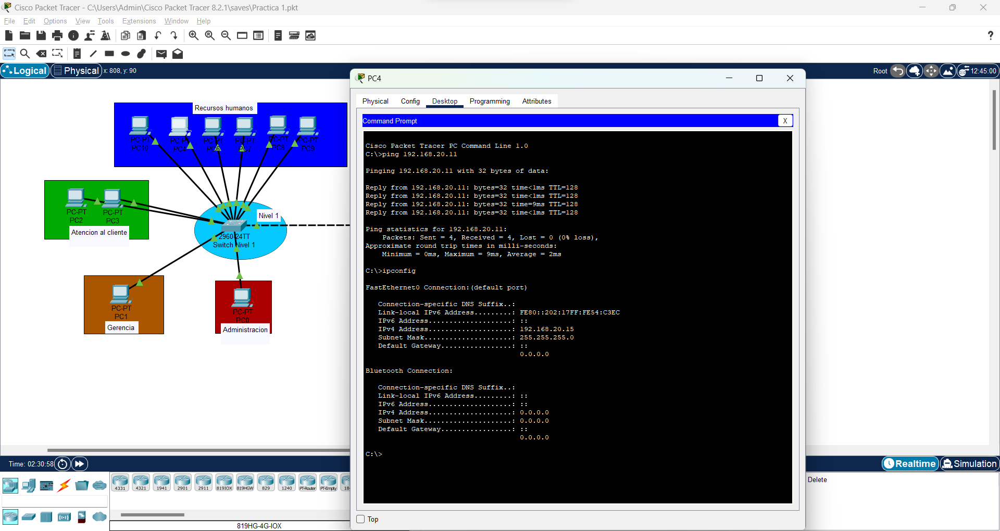

# MANUAL TEORICO

Una empresa correspondiente ha realizado una evaluacion para determinar si se tiene conocimiento en el area como tecnico de redes

### Objetivos
- Demostrar el conocimiento adquirido respecto a los protocolos Ethernet, IP, ARP e ICMP.
- Demostrar el conocimiento requerido para la configuración de máquinas virtuales
VPC y switches de capa 2.
- Emplear la herramienta Packet Tracer para desarrollar la topología de acuerdo con
las especificaciones dadas.
- Emplear el modo simulación de Packet Tracer para la captura de paquetes. 

### Software
- Packet Tracer

## 1. Configuracion de PC's

A continuación se mostrara los puertos utilizados del cable de ethernet del switch con las computadoras
Nivel 1
•	11 - Administracion
•	12 - Gerencia
•	13-14 - Atencion al cliente
•	15- 20 Recursos humanos

Nivel 2 
•	11-13 Oficina A
•	14- 16 Oficina C
•	17 - 22 Oficina B

##### Administracion

##### Gerencia

##### Atencion Al cliente

##### Recursos humanos

##### Oficina A

##### Oficina B

##### Oficina C

## 2. Pings entre hosts
Ping PC4 (Recursos humanos) con PC1 (Gerencia)

Ping PC22 (Oficina B) con PC2 (Atención al cliente)

PING PC27 (Oficina C) con PC12 (Oficina A)

## 3. Paquete ARP
PC de administracion a PC de la oficina C

