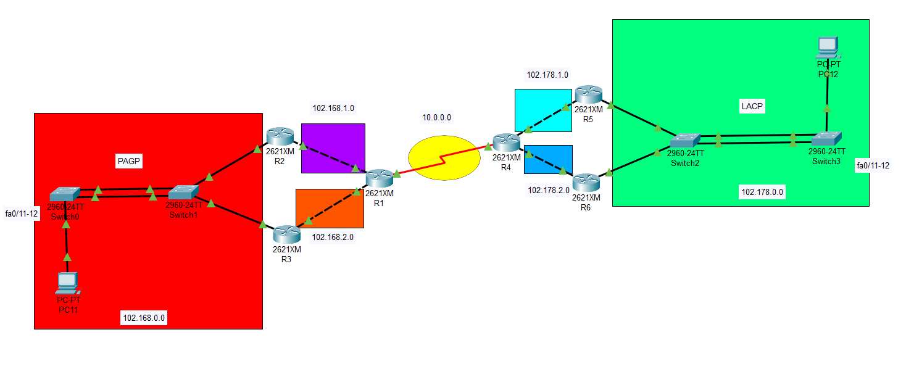
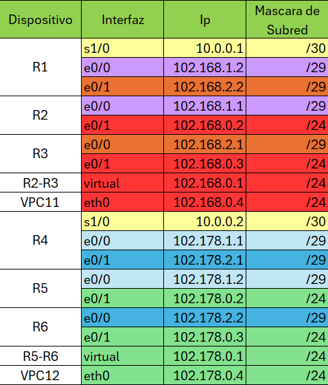
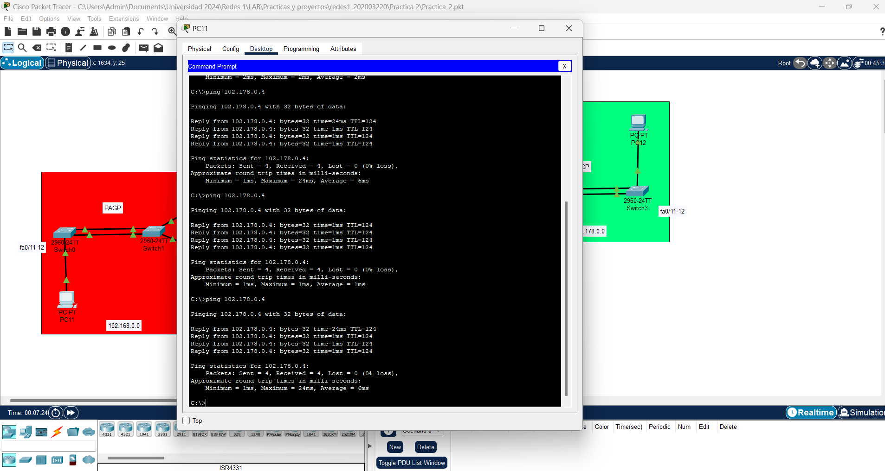
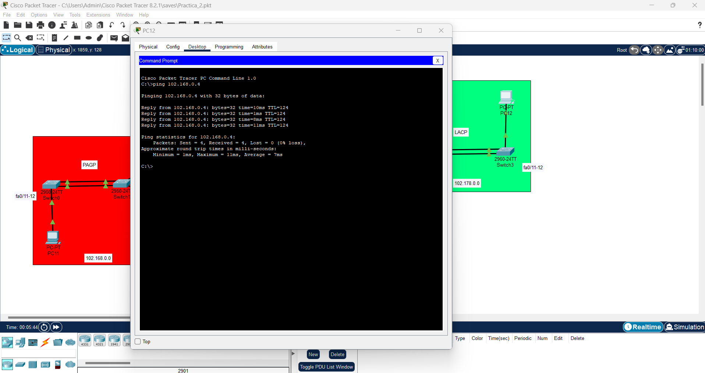

# Manual Tecnico
### Marco Antonio Solis Gonzalez - 202003220
La Academia Técnica de Formación Empresarial se interesaron en la infraestructura para la comunicación entre ambos sitios, por lo que se le encargó el realizar una simulación de como sería la topología del mismo, incluyendo acceso a las redes privadas y redundancia de enlaces.

## Objetivos
- Demostrar el conocimiento adquirido respecto a la agregación de enlaces.
- Demostrar el conocimiento adquirido para la creación de rutas estáticas.
- Demostrar el conocimiento adquirido respecto a la puerta de
enlace predeterminada, así como también para el manejo de protocolos de redundancia en la misma.
- Emplear la herramienta PacketTracer para desarrollar la topología de acuerdo con las especificaciones dadas.

## Software
- Packet Tracer

## Topología de la red

## Direcciones Ip

## Resumen de Comandos
### Creacion del PortChannel PAGP Y LACP
#### PAGP 
##### switch 0
- enable
- configure terminal
- interface range f0/11-12
- channel-group 1 mode desirable
- exit 
- interface port-channel 1
- switchport mode trunk
- end
- wr

##### switch 1
- enable
- configure terminal
- interface range f0/11-12
- channel-group 1 mode auto
- exit 
- interface port-channel 1
- switchport mode trunk
- end
- wr

#### LACP 
##### Switch 2-3
- enable
- configure terminal
- interface range f0/11-12
- channel-group 1 mode active
- exit
- interface port-channel 1
- switchport mode trunk
- end
- wr

### Configuracion de ip a cada router
#### R1
1. 
- enable
- configure terminal
- interface fa0/1
- ip address 102.168.2.2 255.255.255.248
- no shutdown
2. 
- enable
- configure terminal
- interface fa0/0
- ip address 102.168.1.2 255.255.255.248
- no shutdown
3. 
- enable
- configure terminal
- interface se1/0
- ip address 10.0.0.1 255.255.255.252
- no shutdown

#### R2
1. 
- enable
- configure terminal
- interface fa0/0
- ip address 102.168.1.1 255.255.255.248
- no shutdown
2. 
- enable
- configure terminal
- interface fa0/1
- ip address 102.168.0.2 255.255.255.0
- no shutdown

#### R3
1. 
- enable
- configure terminal
- interface fa0/0
- ip address 102.168.2.1 255.255.255.248
- no shutdown
2. 
- enable
- configure terminal
- interface fa0/1
- ip address 102.168.0.3 255.255.255.0
- no shutdown

#### R4
1. 
- enable
- configure terminal
- interface fa0/0
- ip address 102.178.1.1 255.255.255.248
- no shutdown
2. 
- enable
- configure terminal
- interface fa0/1
- ip address 102.178.2.1 255.255.255.248
- no shutdown
3. 
- enable
- configure terminal
- interface se1/0
- ip address 10.0.0.2 255.255.255.252
- no shutdown

#### R5
1. 
- enable
- configure terminal
- interface fa0/0
- ip address 102.178.1.2 255.255.255.248
- no shutdown
2. 
- enable
- configure terminal
- interface fa0/0
- ip address 102.178.0.2 255.255.255.0
- no shutdown
#### R6
1. 
- enable
- configure terminal
- interface fa0/0
- ip address 102.178.2.2 255.255.255.248
- no shutdown
2. 
- enable
- configure terminal
- interface fa0/0
- ip address 102.178.0.3 255.255.255.0
- no shutdown

### Configuracion HSRP R2-R3 R5-R6
#### R2
- enable
- configure terminal
- interface fa0/1
- standby version 2
- standby priority 109
- standby 21 preempt

#### R3
- enable
- configure terminal
- interface fa0/1
- standby version 2
- standby priority 100

#### R5
- enable
- configure terminal
- interface fa0/1
- standby version 2
- standby priority 109
- standby 21 preempt

#### R6
- enable
- configure terminal
- interface fa0/1
- standby version 2
- standby priority 100

### Configuracion de rutas estaticas
#### R1
- enable
- configure terminal
- ip route 102.168.0.0 255.255.255.0 102.168.1.1 
- ip route 102.168.0.0 255.255.255.0 102.168.2.1 
- ip route 102.178.0.0 255.255.255.0 10.0.0.2 
- ip route 10.0.0.0 255.255.255.252 10.0.0.2 
- ip route 102.178.1.0 255.255.255.248 10.0.0.2 
- ip route 102.178.2.0 255.255.255.248 10.0.0.2 
- ip route 102.168.1.0 255.255.255.248 102.168.1.1 
- ip route 102.168.2.0 255.255.255.248 102.168.2.1 

#### R2
- enable 
- configure terminal
- ip route 102.168.1.0 255.255.255.248 102.168.1.2 
- ip route 10.0.0.0 255.255.255.252 102.168.1.2 
- ip route 102.178.1.0 255.255.255.248 102.168.1.2 
- ip route 102.178.2.0 255.255.255.248 102.168.1.2 
- ip route 102.178.0.0 255.255.255.0 102.168.1.2 
- ip route 102.168.2.0 255.255.255.248 102.168.1.2 

#### R3
- enable
- configure terminal 
- ip route 102.168.2.0 255.255.255.248 102.168.2.2 
- ip route 10.0.0.0 255.255.255.252 102.168.2.2 
- ip route 102.178.1.0 255.255.255.248 102.168.2.2 
- ip route 102.178.2.0 255.255.255.248 102.168.2.2 
- ip route 102.178.0.0 255.255.255.0 102.168.2.2 
- ip route 102.168.1.0 255.255.255.248 102.168.2.2

#### R4
- enable
- configure terminal
- ip route 102.178.0.0 255.255.255.0 102.178.1.2 
- ip route 102.178.0.0 255.255.255.0 102.178.2.2 
- ip route 10.0.0.0 255.255.255.252 10.0.0.1 
- ip route 102.168.0.0 255.255.255.0 10.0.0.1 
- ip route 102.168.1.0 255.255.255.248 10.0.0.1 
- ip route 102.168.2.0 255.255.255.248 10.0.0.1 
- ip route 102.178.1.0 255.255.255.248 102.178.1.2 
- ip route 102.178.2.0 255.255.255.248 102.178.2.2

#### R5
- enable
- configure terminal
- ip route 102.178.1.0 255.255.255.248 102.178.1.1 
- ip route 10.0.0.0 255.255.255.252 102.178.1.1 
- ip route 102.168.1.0 255.255.255.248 102.178.1.1 
- ip route 102.168.2.0 255.255.255.248 102.178.1.1 
- ip route 102.168.0.0 255.255.255.0 102.178.1.1 
- ip route 102.178.2.0 255.255.255.248 102.178.1.1

#### R6
- enable
- configure terminal
- ip route 102.178.2.0 255.255.255.248 102.178.2.1 
- ip route 10.0.0.0 255.255.255.252 102.178.2.1 
- ip route 102.168.1.0 255.255.255.252 102.178.2.1 
- ip route 102.168.2.0 255.255.255.248 102.178.2.1 
- ip route 102.168.0.0 255.255.255.0 102.178.2.1 
- ip route 102.178.1.0 255.255.255.248 102.178.2.1

### Ping de PC11 a PC12

### Ping de PC12 a PC11
