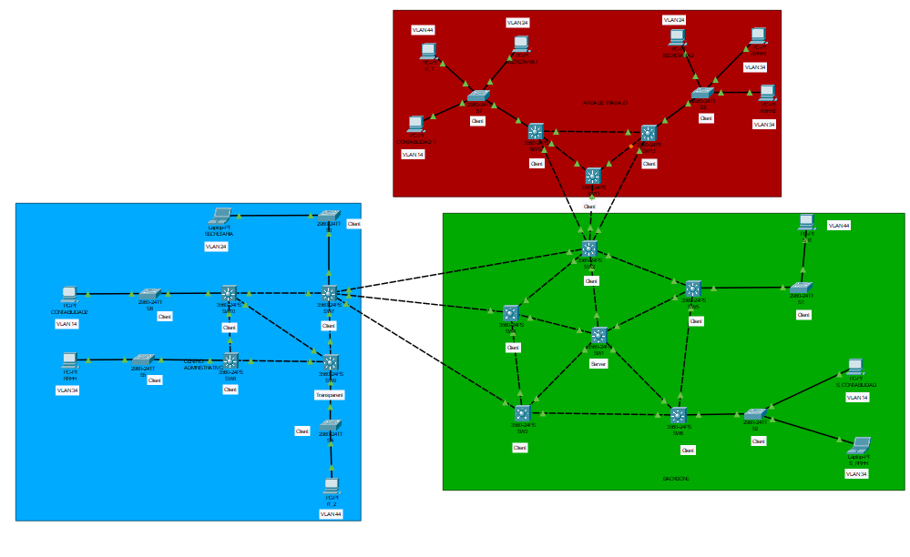

# Manual Tecnico 
### Jonatan Leonel Garcia Arana - 202000424
### Marco Antonio Solis Gonzalez - 202003220
### DIRECIONES IP Y VLANS
 

 

### TOPOLOGIAS
#### Area De Trabajo
 

#### Backbone
 

#### Centro Administrativo
 

#### Topologia Completa
 

### COMANDOS

### Configuracion del vtp en cada switch
##### Configuracion del SW1 (Server)
- enable
- configure terminal
- vtp mode server
- vtp domain P10
- vtp password usac
- vtp version 2
- exit
- wr

#### configuracion de los SW2, SW3, SW4, SW5, SW6, SW7, SW8, SW10, SW11, SW12, SW13 (Client)
- enable
- configure terminal
- vtp mode client
- vtp domain P10
- vtp password usac
- exit
- wr

#### configuracion del SW9 (Transparent)
- enable
- configure terminal 
- vtp mode transparent
- vtp domain P10
- vtp password usac
- exit
- wr

##### configuracion de los S1 - S8
- enable
- configure terminal
- vtp mode client
- vtp domain P10
- vtp password usac
- exit
- wr

### Configuracion mode trunk para todos los switchs 3560
- enable
- configure terminal
- interface range f0/ #rango dependiendo de cada switch
    - SW1: 1-5
    - SW2: 1-7
    - SW3: 1-4
    - SW4: 1-4
    - SW5: 1-4
    - SW6: 1-4
    - SW7: 1-6
    - SW8: 1-3
    - SW9: 1-4
    - SW10: 1-4
    - SW11: 1-3
    - SW12: 1-4
    - SW13: 1-4
- switchport trunk encapsulation dot1q
- switchport mode trunk
- switchport trunk allowed vlan all
- exit
- wr

### Configuracion mode trunk para todos los switchs 2960
- enable
- configure terminal
- interface f0/ #numero del puerto al switch 3560
    - S1: 1
    - S2: 1
    - S3: 1
    - S3: 1
    - S4: 1
    - S6: 1
    - S7: 1
    - S8: 1
- switchport mode trunk
- switchport trunk allowed vlan all
- exit
- wr

### Creacion de VLAN
Switch SW0
- enable
- configure terminal
- vlan 14
- name contabilidad
- vlan 24
- name secretaria
- vlan 34
- name rrhh
- vlan 44
- name it
- exit
- exit
- wr

    
### Configuracion del modo acceso
- enable
- configure terminal
- interface f0/#puerto donde esta el difpositivo final
    - S1: 11
        - switchport mode access
        - switchport access vlan 44
    - S2: 
        1. 11
            - switchport mode access
            - switchport access vlan 14
        2. 12
            - switchport mode access
            - switchport access vlan 34
    - S3: 11
        - switchport mode access
        - switchport access vlan 24
    - S4: 11
        - switchport mode access
        - switchport access vlan 44
    - S5: 11
        - switchport mode access
        - switchport access vlan 34
    - S6: 11
        - switchport mode access
        - switchport access vlan 14
    - S7: 
        1. 11
            - switchport mode access
            - switchport access vlan 24
        2. 12
            - switchport mode access
            - switchport access vlan 14
        3. 13
            - switchport mode access
            - switchport access vlan 14
    - S8: 
        1. 11
            - switchport mode access
            - switchport access vlan 24
        2. 12
            - switchport mode access
            - switchport access vlan 34
        3. 13
            - switchport mode access
            - switchport access vlan 34
- no shutdown
- exit
- wr

### Configuracion de STP
#### Configurando switch Root
- enable
- configure terminal
- spanning-tree vlan 1 root primary 
- exit
- write

#### Configurando switches modo STP
- enable
- configue terminal
- spanning-tree mode pvst
- exit
- write

### PING ENTRE AREAS
## ip de recursos humanos
 

## ip del computador que hara ping
 

## Ping entre RRHH
 

## ip de IT
 

## ip del computador que hara ping
 

## Ping entre IT
 

