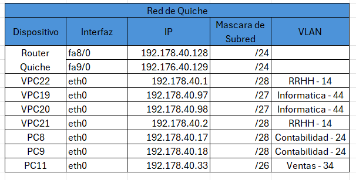

# Manual Tecnico 
### Jonatan Leonel Garcia Arana - 202000424
### Marco Antonio Solis Gonzalez - 202003220
Una reconocida empresa de venta de línea blanca y electrodomésticos lo contrató para que trabaje en la red regional, interconectando de momento las sedes entre Jutiapa y la central de la ciudad capital.

## Objetivos
- Poner en práctica lo aprendido en el proyecto 1 y prácticas 1 y 2.
- Demostrar el conocimiento adquirido sobre el enrutamiento entre VLANS usando Router on a stick e interfaces virtuales.
- Demostrar el conocimiento adquirido sobre VLSM (Variable Length Subnet Mask) y FLSM (Fixed Length Subnet Mask).
- Demostrar el conocimiento adquirido sobre los protocolos de enrutamiento estático.

## Software
- Packet Tracer

## Topología de la red

## Direcciones IP
Primero se utilizo vlsm para la creacion de las subredes y dependiendo de los equipos requeridos se utilizaron las siguientes mascaras de subred
### Jutiapa

#### Escuintla

### Quiche

### Peten

### router-Jutiapa-J1

### router-Jutiapa-J2

Luego se utilizo FLSM para la creacion de las subredes en el CORE quedando de la siguiente forma

### Tablas de red finales

## Resumen de Comandos
### Sede de Jutiapa

#### LACP 
##### Switch 2-3
- enable
- configure terminal
- interface range f0/2-3
- channel-group 1 mode active
- exit
- interface port-channel 1
- switchport mode trunk
- end
- wr

#### Configuracion de ip de cada router
#### J1
1. 
- enable
- configure terminal
- inteface f1/0
- ip address 192.167.40.2 255.255.255.0
- no shutdown 
- exit
2. 
- enable
- configure terminal
- interface f0/0
- ip address 11.0.0.2 255.255.255.252
- no shutdown
- exit
- end
- wr

#### J2
1. 
- enable
- configure terminal
- inteface f1/0
- ip address 192.167.40.3 255.255.255.0
- no shutdown 
- exit
2. 
- enable
- configure terminal
- interface f0/0
- ip address 12.0.0.2 255.255.255.252
- no shutdown
- exit
- end
- wr

#### Configuracion de HSRP J1-J2
##### J1
- enable
- configure terminal
- interface fa1/0
- standby version 2
- standby 21 192.167.40.1
- standby 21 priority 109
- standby 21 preempt
- end
- wr

##### J2
- enable
- configure terminal
- interface fa1/0
- standby version 2
- standby 21 192.167.40.1
- standby priority 100
- end
- wr

#### Configuracion del VTP Y RSTP ESW1 SW2 SW3
Falta por terminar
##### ESW1
- enable
- configure terminal
- vtp mode server
- vtp domain P40
- vtp password usac40
- vtp version 2
- exit
- wr

##### SW2 - SW3
- enable
- configure terminal
- vtp mode client
- vtp domain P40
- vtp password usac40
- exit
- wr

##### Creacion de VLANs ESW1
- enable
- configure terminal
- vlan 14
- name RRHH
- vlan 24
- name contabilidad
- vlan 34
- name ventas
- vlan 44
- name informatica
- end 
- wr

#### Truncar los switches
##### ESW1
- enable
- configure terminal
- interface range f0/1-2
- switchport trunk encapsulation dot1q
- switchport mode trunk
- switchport trunk allowed vlan all
- end
- wr

##### SW2 - SW3
- enable
- configure terminal
- interface range f0/1-3
- switchport mode trunk
- switchport trunk allowed vlan all
- end
- wr

#### Configuracion del modo acceso 
##### SW2
- enable
- configure terminal
- interface f0/11
- switchport mode access 
- switchport access vlan 14
- exit
- interface f0/12
- switchport mode access 
- swithcport access vlan 24
- exit
- interface f0/13
- switchport mode access
- switchport access vlan 24
- exit
- end
- wr

##### SW3
- enable
- configure terminal
- interface f0/11
- switchport mode access 
- switchport access vlan 34
- exit
- interface f0/12
- switchport mode access 
- swithcport access vlan 14
- exit
- interface f0/13
- switchport mode access
- switchport access vlan 44
- exit
- end
- wr

##### RSTP
##### Configuramos el root ESW1
- enable
- configure terminal
- spanning-tree vlan 1 root primary 
- exit
- wr

##### Configuramos el modo rstp en ESW1, SW2, SW3
- enable
- configue terminal
- spanning-tree mode rapid-pvst
- exit
- write

### Sede de Escuintla

#### Configuracion del VTP Switch2
- enable
- configure terminal
- vtp mode server
- vtp domain P40
- vtp password usac40
- vtp version 2
- exit
- wr

#### Creacion de las VLANs Switch2
- enable
- configure terminal
- vlan 14 
- name RRHH
- vlan 34
- name ventas
- end
- wr

#### configuracion del modo acceso Switch2
- enable
- configure terminal
- interface f0/11 
- switchport mode access
- switchport access vlan 14
- exit
- interface f0/12
- switchport mode access
- switchport access vlan 34
- end
- wr

### Sede Peten

#### Configuracion del VTP ESW2
- enable
- configure terminal
- vtp mode server
- vtp domain P40
- vtp password usac40
- vtp version 2
- exit
- wr

#### Creacion de las VLANs ESW2
- enable
- configure terminal
- vlan 14 
- name RRHH
- vlan 34
- name ventas
- vlan 44
- name informatica
- end
- wr

#### configuracion del modo acceso ESW2
- enable
- configure terminal
- interface f0/11 
- switchport mode access
- switchport access vlan 14
- exit
- interface f0/12
- switchport mode access
- switchport access vlan 34
- exit
- interface f0/13
- switchport mode access
- switchport access vlan 44
- end
- wr

### Sede Quiche

#### Configuracion de ip del router QUICHE
1.
- enable
- configure terminal
- interface f8/0
- ip address 192.178.40.128 255.255.255.0
- no shutdown
- exit
2.
- enable
- configure terminal
- interface f9/0
- ip address 192.178.40.129 255.255.255.0
- no shutdown
- exit
- end
- wr

#### Configuracion del VTP
##### SW1
- enable
- configure terminal
- vtp mode server
- vtp domain P40
- vtp password usac40
- vtp version 2
- exit
- wr

##### Switch3
- enable
- configure terminal
- vtp mode transparent
- vtp domain P40
- vtp password usac40
- vtp version 2
- exit
- wr

#### Creacion de las VLANs SW1 y Switch3
- enable
- configure terminal
- vlan 14
- name RRHH
- vlan 24
- name contabilidad
- vlan 34
- name ventas
- vlan 44
- name informatica
- end 
- wr

#### Configuracion del modo acceso
##### SW1
- enable
- configure terminal
- interface f0/11 
- switchport mode access
- switchport access vlan 14
- exit
- interface f0/12
- switchport mode access
- switchport access vlan 44
- exit 
- interface f0/13
- switchport mode access
- switchport access vlan 44
- exit 
- interface f0/14 
- switchport mode access
- switchport access vlan 14
- end
- wr

#### Switch3
- enable
- configure terminal
- interface f0/11 
- switchport mode access
- switchport access vlan 24
- exit
- interface f0/12
- switchport mode access
- switchport access vlan 24
- exit 
- interface f0/13
- switchport mode access
- switchport access vlan 34
- end
- wr

### Sede Core

#### Configuracion de ip de cada router

##### CENTRAL 
- enable
- configure terminal
- interface fa0/0
- ip address 10.0.0.17 255.255.255.240
- no shutdown 
- exit
- interface fa1/0
- ip address 10.0.0.1 255.255.255.240
- no shutdown 
- exit
- interface fa6/0
- ip address 10.0.0.97 255.255.255.240
- no shutdown 
- exit
- interface fa7/0
- ip address 10.0.0.145 255.255.255.240
- no shutdown 
- end
- wr
##### ESCUINTLA
- enable
- configure terminal
- interface fa0/0
- ip address 10.0.0.18 255.255.255.240
- no shutdown 
- exit
- interface fa1/0
- ip address 10.0.0.33 255.255.255.240
- no shutdown 
- exit
- interface fa6/0
- ip address 10.0.0.81 255.255.255.240
- no shutdown 
- exit
- interface fa7/0
- ip address 10.0.0.113 255.255.255.240
- no shutdown 
- end
- wr
##### JUTIAPA
- enable
- configure terminal
- interface fa0/0
- ip address 10.0.0.34 255.255.255.240
- no shutdown 
- exit
- interface fa1/0
- ip address 10.0.0.49 255.255.255.240
- no shutdown 
- exit
- interface fa6/0
- ip address 10.0.0.98 255.255.255.240
- no shutdown 
- exit
- interface fa7/0
- ip address 10.0.0.129 255.255.255.240
- no shutdown 

Tambien asignaremos los de la red 11.0.0.0 y 12.0.0.0

- interface fa8/0
- ip address 11.0.0.1 255.255.255.252
- no shutdown 
- exit
- interface fa9/0
- ip address 12.0.0.1 255.255.255.252
- no shutdown 
- end
- wr

##### PETEN
- enable
- configure terminal
- interface fa0/0
- ip address 10.0.0.129 255.255.255.240
- no shutdown 
- exit
- interface fa1/0
- ip address 10.0.0.50 255.255.255.240
- no shutdown 
- exit
- interface fa6/0
- ip address 10.0.0.65 255.255.255.240
- no shutdown 
- exit
- interface fa7/0
- ip address 10.0.0.114 255.255.255.240
- no shutdown 
- end
- wr
##### QUICHE
- enable
- configure terminal
- interface fa0/0
- ip address 10.0.0.66 255.255.255.240
- no shutdown 
- exit
- interface fa1/0
- ip address 10.0.0.2 255.255.255.240
- no shutdown 
- exit
- interface fa6/0
- ip address 10.0.0.130 255.255.255.240
- no shutdown 
- exit
- interface fa7/0
- ip address 10.0.0.82 255.255.255.240
- no shutdown 
- end
- wr

#### Ruteo dinamico para el CORE
##### ESCUINTLA Y JUTIAPA (RIP)
###### Jutiapa
- enable
- configure terminal
- router rip
- version 2
- network 10.0.0.32
- network 10.0.0.48
- network 11.0.0.0
- network 12.0.0.0
- network 10.0.0.96
- network 10.0.0.112
- end 
- wr

###### Escuintla
- enable
- configure terminal
- router rip
- version 2
- network 10.0.0.16
- network 10.0.0.80
- network 11.0.0.112
- network 12.0.0.32
- newtork 192.148.40.0
- end 
- wr

###### J1 
- enable
- configure terminal
- router rip
- version 2
- network 11.0.0.0
- network 192.168.40.0
- end 
- wr

###### J2
- enable
- configure terminal
- router rip
- version 2
- network 12.0.0.0
- network 192.168.40.0
- end 
- wr

##### CENTRAL (OSPF)

### Comandos para verificar la configuracion
- show vtp status
- show running-config
- show standby
- show startup-config
- show ip route
- show spanning-tree

